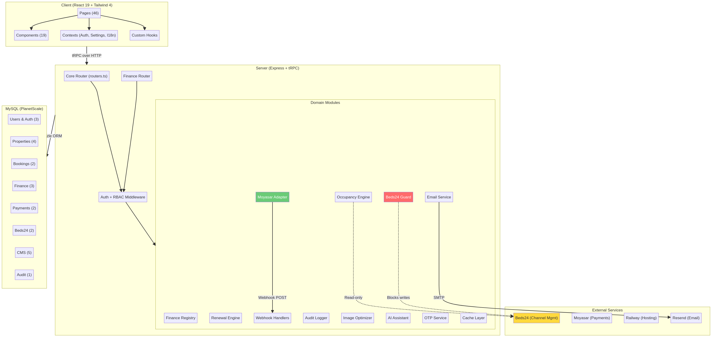

# Developer Handover Pack — Monthly Key

**Date:** 2026-02-27  
**Version:** 1.0  
**Purpose:** Enable a new developer to onboard fast and safely extend the system.

---

## Table of Contents

1. [System Overview](#1-system-overview)
2. [Setup & Runbook](#2-setup--runbook)
3. [Database Reference](#3-database-reference)
4. [Workflow Reference](#4-workflow-reference)
5. [Release Checklist](#5-release-checklist)

---

## 1. System Overview

### Architecture Diagram



### Technology Stack

| Layer | Technology | Version |
|-------|-----------|---------|
| Frontend | React 19 + TypeScript | 19.x |
| Styling | Tailwind CSS 4 + shadcn/ui | 4.x |
| Routing (Client) | Wouter | 3.x |
| API Layer | tRPC | 11.x |
| Server | Express.js | 4.x |
| ORM | Drizzle ORM | 0.38.x |
| Database | MySQL (PlanetScale) | 8.x |
| Payments | Moyasar API | Phase 1 |
| Channel Mgmt | Beds24 SDK | Custom |
| Email | Resend | — |
| Hosting | Railway | — |
| CI | GitHub Actions | — |

### Module Map

| Module | Path | Responsibility | Dependencies |
|--------|------|---------------|-------------|
| **Core Router** | `server/routers.ts` | All tRPC route definitions | All modules |
| **Finance Registry** | `server/finance-registry.ts` | Building/unit/ledger CRUD + KPIs | `db.ts`, `beds24-guard.ts` |
| **Finance Routes** | `server/finance-routers.ts` | tRPC router for finance | `finance-registry.ts`, `audit-log.ts` |
| **Occupancy** | `server/occupancy.ts` | Occupancy calculation + snapshots | `db.ts` |
| **Renewal** | `server/renewal.ts` | Extension eligibility + workflow | `occupancy.ts`, `finance-registry.ts` |
| **Moyasar** | `server/moyasar.ts` | Payment provider adapter | `finance-registry.ts` |
| **Webhooks** | `server/payment-webhooks.ts` | Webhook handlers | `moyasar.ts` |
| **Beds24 Guard** | `server/beds24-guard.ts` | Runtime safety guardrail | `db.ts` |
| **Audit Log** | `server/audit-log.ts` | Immutable audit trail | `db.ts` |
| **Cache** | `server/cache.ts` | In-memory caching layer | — |
| **Image Optimizer** | `server/image-optimizer.ts` | Image processing + CDN | — |
| **Email** | `server/email.ts` | Transactional emails via Resend | — |
| **AI Assistant** | `server/ai-assistant.ts` | Internal Copilot | `knowledgeBase` table |
| **OTP** | `server/otp.ts` | Phone/email verification | `rate-limiter.ts` |
| **Lease Contract** | `server/lease-contract.ts` | PDF contract generation | — |

### Integration Map

```
┌─────────────────────────────────────────────────────┐
│                   Monthly Key                        │
│                                                      │
│  ┌──────────┐  ┌──────────┐  ┌──────────────────┐  │
│  │ Moyasar  │  │ Beds24   │  │ Resend (Email)   │  │
│  │ Adapter  │  │ Guard    │  │                   │  │
│  └────┬─────┘  └────┬─────┘  └────────┬──────────┘  │
│       │              │                 │             │
└───────┼──────────────┼─────────────────┼─────────────┘
        │              │                 │
        ▼              ▼                 ▼
  ┌──────────┐  ┌──────────────┐  ┌──────────┐
  │ Moyasar  │  │ Beds24 SDK   │  │ Resend   │
  │ API      │  │ (READ-ONLY)  │  │ API      │
  │          │  │ ⚠ IMMUTABLE  │  │          │
  └──────────┘  └──────────────┘  └──────────┘
```

> **CRITICAL:** The Beds24 SDK under `packages/beds24-sdk/` is immutable. The system reads from Beds24 but NEVER writes bookings, availability, or rates back to it. The `beds24-guard.ts` module enforces this at runtime.

---

## 2. Setup & Runbook

### Local Setup

**Prerequisites:**
- Node.js 22.x
- pnpm 9.x
- MySQL 8.x (or PlanetScale connection)

**Steps:**

```bash
# 1. Clone the repository
gh repo clone raneemndmo-collab/mk
cd mk

# 2. Install dependencies
pnpm install

# 3. Configure environment
cp .env.example .env
# Edit .env with your database credentials and API keys

# 4. Run database migrations
pnpm drizzle-kit push

# 5. Start development server
pnpm dev
```

### Environment Variables

| Variable | Required | Description |
|----------|----------|-------------|
| `DATABASE_URL` | Yes | MySQL connection string |
| `JWT_SECRET` | Yes | JWT signing secret |
| `RESEND_API_KEY` | No | Email service API key |
| `VITE_APP_TITLE` | No | Application title |
| `VITE_APP_LOGO` | No | Logo URL |

Payment keys (Moyasar) are stored in `platformSettings` table, not in environment variables.

### Running Tests

```bash
# Vitest suite (requires DB)
pnpm test

# Custom test suites (file-based, no DB required)
npx tsx server/tests/finance-registry.test.ts    # 219 tests
npx tsx server/tests/moyasar.test.ts             # 35 tests
npx tsx server/tests/payment-badges.test.ts      # 58 tests

# CI guardrail
npm run check:beds24-immutable
```

### Running Migrations

```bash
# Generate migration from schema changes
pnpm drizzle-kit generate

# Push migration to database
pnpm drizzle-kit push

# View migration status
pnpm drizzle-kit status
```

### Deployment (Railway)

The application auto-deploys from the `main` branch on GitHub to Railway.

**Production URL:** `https://monthly-key-app-production.up.railway.app/`

**Rollback plan:**
1. Identify the last working commit via `git log --oneline`
2. Create a revert commit: `git revert HEAD`
3. Push to main: `git push origin main`
4. Railway will auto-deploy the revert
5. If database migration needs rollback, create a DOWN migration manually

---

## 3. Database Reference

### Schema Overview

The database has 42 tables organized into domains. The full schema is defined in `drizzle/schema.ts`.

### Key Tables and Relationships

#### Finance Domain

```
buildings (1) ──── (N) units (1) ──── (0..1) beds24_map
    │                    │
    │                    │
    └──── (N) payment_ledger ────── (0..1) payment_ledger (parent)
                  │
                  └──── booking_extensions
```

#### Core Domain

```
users (1) ──── (N) bookings (1) ──── (N) payments
  │                    │
  │                    └──── (N) booking_extensions
  │
  └──── (N) favorites
  └──── (N) reviews
  └──── (N) conversations ──── (N) messages
```

### Key Table Details

**`payment_ledger`** — Central financial record

| Column | Type | Description |
|--------|------|-------------|
| `id` | INT AUTO_INCREMENT | Primary key |
| `invoiceNumber` | VARCHAR(50) UNIQUE | Human-readable invoice ID |
| `buildingId` | INT | Building reference |
| `unitId` | INT | Unit reference |
| `bookingId` | INT | Booking reference |
| `type` | ENUM | RENT, RENEWAL_RENT, PROTECTION_FEE, DEPOSIT, CLEANING, PENALTY, REFUND, ADJUSTMENT |
| `status` | ENUM | DUE, PENDING, PAID, FAILED, REFUNDED, VOID |
| `amount` | DECIMAL(10,2) | Amount in SAR |
| `paymentMethod` | ENUM | MADA_CARD, APPLE_PAY, GOOGLE_PAY, TABBY, TAMARA, BANK_TRANSFER, CASH |
| `provider` | ENUM | moyasar, tabby, tamara, manual |
| `providerRef` | VARCHAR(255) | External payment reference |
| `parentLedgerId` | INT | Self-reference for corrections |
| `paidAt` | DATETIME | When payment was confirmed |

**`beds24_map`** — Unit-to-Beds24 mapping

| Column | Type | Description |
|--------|------|-------------|
| `unitId` | INT UNIQUE | Local unit reference |
| `beds24RoomId` | VARCHAR(100) UNIQUE | Beds24 room ID |
| `sourceOfTruth` | ENUM('BEDS24','LOCAL') | Who controls occupancy data |
| `connectionType` | ENUM('API','ICAL') | How data is synced |
| `icalImportUrl` | TEXT | iCal feed URL for import |
| `beds24ApiKey` | VARCHAR(255) | API key for this room |

### Common Queries

```sql
-- Get building KPIs
SELECT 
  COUNT(*) as totalUnits,
  SUM(CASE WHEN unitStatus = 'AVAILABLE' THEN 1 ELSE 0 END) as available,
  SUM(monthlyBaseRentSAR * 12) as PAR
FROM units WHERE buildingId = ? AND isArchived = 0;

-- Get collected YTD
SELECT SUM(amount) as collected
FROM payment_ledger
WHERE buildingId = ? AND status = 'PAID'
  AND type IN ('RENT', 'RENEWAL_RENT')
  AND YEAR(paidAt) = YEAR(NOW());

-- Check if unit is Beds24-controlled
SELECT sourceOfTruth FROM beds24_map WHERE unitId = ? LIMIT 1;
```

---

## 4. Workflow Reference

### Payment Flow (DUE → PAID via Webhook)

```
1. Invoice created → createLedgerEntry(status: DUE)
2. User initiates payment → createMoyasarPayment()
   → Ledger updated to PENDING
   → User redirected to Moyasar checkout
3. User completes payment on Moyasar
4. Moyasar sends webhook POST to /api/webhooks/moyasar
5. handleMoyasarWebhookVerified():
   a. Verify HMAC-SHA256 signature
   b. If invalid → 401 Unauthorized
   c. If valid → updateLedgerStatusSafe(id, 'PAID', { webhookVerified: true })
6. User redirect page polls status (display only, never finalizes)
```

> **CRITICAL:** The redirect/success page NEVER sets PAID. Only the webhook handler can finalize payments.

### Ledger Immutability Rules

```
PAID → Cannot change (except to REFUNDED via createAdjustmentOrRefund)
REFUNDED → Cannot change
VOID → Cannot change
DUE → Can change to PENDING, PAID (webhook only), FAILED, VOID
PENDING → Can change to PAID (webhook only), FAILED
FAILED → Can change to PENDING (retry), VOID
```

Corrections are made by creating child entries:
```
Original (PAID, $500) ← parentLedgerId ← Refund (REFUND, -$500)
```

### Occupancy Derivation Rules

```
For each unit:
  1. Check beds24_map for the unit
  2. IF sourceOfTruth = 'BEDS24':
     a. Try Beds24 API data → return BEDS24 source
     b. Try iCal feed → return BEDS24 source
     c. If neither available → return UNKNOWN (never LOCAL fallback)
  3. IF no mapping OR sourceOfTruth = 'LOCAL':
     → Check local bookings table → return LOCAL source
  4. Units with status BLOCKED/MAINTENANCE:
     → Excluded from "available" denominators in KPIs
```

### Extension Approval Flow

```
1. Tenant requests extension
2. System checks eligibility:
   - Booking must be active
   - renewalsUsed < maxRenewals
   - Within renewal window (default 14 days before end)
3. IF eligible:
   a. Create booking_extensions row (PENDING_APPROVAL)
   b. Create payment_ledger row (DUE, type: RENEWAL_RENT)
4. Admin reviews:
   a. IF unit is Beds24-controlled:
      - MUST provide beds24ChangeNote
      - Note documents what was changed in Beds24 dashboard/calendar
      - System NEVER writes to Beds24
   b. Admin approves → extension status = APPROVED
5. Payment webhook confirms → extension activated
   - For LOCAL units: booking.moveOutDate extended, renewalsUsed++
   - For BEDS24 units: only local records updated, admin must update Beds24 manually
```

---

## 5. Release Checklist

### Pre-Release Checks

| # | Check | Command / Action |
|---|-------|-----------------|
| 1 | Beds24 SDK immutability | `npm run check:beds24-immutable` |
| 2 | Custom test suite passes | `npx tsx server/tests/finance-registry.test.ts` |
| 3 | Moyasar tests pass | `npx tsx server/tests/moyasar.test.ts` |
| 4 | Payment badges tests pass | `npx tsx server/tests/payment-badges.test.ts` |
| 5 | Vitest suite (non-DB) passes | `pnpm test` (ignore DB-dependent failures) |
| 6 | TypeScript compiles | `pnpm tsc --noEmit` |
| 7 | No hardcoded secrets | `grep -rn "sk_live\|sk_test\|password" server/` |
| 8 | Migrations are additive | Review new `.sql` files for DROP/ALTER |
| 9 | APPROVAL_CHECKLIST.md updated | All items checked |

### Post-Release Monitoring

| # | Check | How |
|---|-------|-----|
| 1 | Health endpoint | `curl https://monthly-key-app-production.up.railway.app/api/health` |
| 2 | Homepage loads | Browser check |
| 3 | Payment flow works | Test payment with Moyasar test mode |
| 4 | Webhook delivery | Check Moyasar dashboard for webhook delivery status |
| 5 | Error logs | Check Railway logs for new errors |
| 6 | KPI dashboard loads | Navigate to `/admin/buildings` |

### Docs Update Checklist

After every release that changes user-facing behavior:

| # | Action |
|---|--------|
| 1 | Identify affected KB topics |
| 2 | Update Arabic KB article (`docs/knowledge-base/ar/`) |
| 3 | Update English KB article (`docs/knowledge-base/en/`) |
| 4 | Update Staff Manuals if workflows changed |
| 5 | Add entry to `docs/CHANGELOG.md` |
| 6 | Test Copilot answers reflect the update |
| 7 | Update this Handover Pack if architecture changed |

### Integration Safety Checklist

| # | Check | Required For |
|---|-------|-------------|
| 1 | `packages/beds24-sdk/**` unchanged | Every release |
| 2 | `services/hub-api/src/` unchanged | Every release |
| 3 | No new writes to Beds24 | Every release |
| 4 | Webhook HMAC verification intact | Payment changes |
| 5 | Ledger immutability guard intact | Finance changes |
| 6 | `assertNotBeds24Controlled` guard intact | Booking/unit changes |
| 7 | All migrations are additive | Schema changes |
